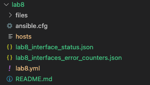
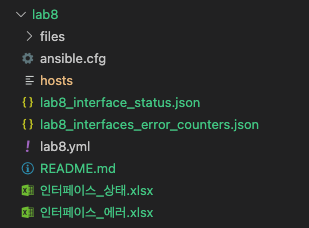

# Ansible Lab #3 - 把查询到的信息导出为Excel文件，并以邮件形式发送

<br><br>

## Lab 步骤

<br>

1. 查看 main.yml 文件内容


```yaml
  vars:
    apic_info: &apic_info
      host:           "{{ aci_host }}"
      user:           "{{ aci_user }}"
      password:       "{{ aci_password }}"
      validate_certs: "{{ aci_valid_cert }}" 
      use_ssl:        "{{ aci_use_ssl }}" 

  tasks:
    - name: "1] API Request - 读取所有接口的状态信息"
      aci_rest:
        <<: *apic_info
        path: /api/class/ethpmPhysIf.json
        method: get
      register: ethpmPhysIf
```
- 通过 YAML Anchor(&) 可以重复使用变量内容
- 通过调用 ethpmPhysIf class，读取所有interface的信息

<br><br>

2. 查看 Playbook 文件(main.yml) 内容。

```yaml
    - name: "2] API Request - 인터페이스의 목록을 수집 (참고: 소요시간을 고려하여 10개만 수집)"
      aci_rest:
        <<: *apic_info
        path: /api/class/l1PhysIf.json?page-size=10     # page-size 옵션 사용 중 참고
        method: get
      register: l1PhysIf

    - name: "3] API Request - 개별 인터페이스의 에러 발생 여부 수집"
      aci_rest:
        <<: *apic_info
        path: "/api/node/mo/{{ item }}.json?query-target=children&target-subtree-class=rmonDot3Stats&target-subtree-class=rmonDot1d&target-subtree-class=rmonEtherStats"
        method: get
      register: rmonEtherStats
      with_items:
        - "{{ l1PhysIf | json_query('imdata[].l1PhysIf.attributes.dn') }}"
```
- l1PhysIf 클래스를 이용하여, 모든 인터페이스의 목록을 수집합니다. (page-size=10 옵션을 사용하여 전체 인터페이스 중 10개만 수집합니다.)
- 3번째 태스크에서는 앞서 수집한 인터페이스 목록을 이용하여, 개별 인터페이스의 에러 카운트 정보를 수집합니다. 각각의 Managed Object 단위로 API 호출하며, 각 MO의 하위 클래스인 rmonDot3Stats, rmonDot1d, rmonEtherStats 에서 모니터 정보를 수집합니다.

<br><br>

3. 1번과 2번에서 수집한 변수값(ethpmPhysIf, rmon)을 Json 파일로 저장합니다.

```yaml
    - name: "4] 수집 데이터를 Json 파일로 저장"
      copy:
        content: "{{ item.content | to_nice_json}}"
        dest:    "{{ item.dest }}"
      no_log: yes
      loop:
        - content:  "{{ ethpmPhysIf | json_query('imdata[].ethpmPhysIf.attributes.{dn:dn, operSt:operSt, operMode:operMode, operSpeed:operSpeed, operDuplex:operDuplex}') }}"
          dest:     interface_status.json
        - content:  "{{ rmon | json_query('results[].{item:item, imdata:imdata[]}') }}" 
          dest:     interfaces_error_counters.json
```
- json_query를 이용하여 각 변수값(ethpmPhysIf, rmon)에서 특정 정보만 파싱하여 새로운 Json 파일로 저장합니다.
- no_log: yes 는 실행 화면에 로그를 축력하지 않도록 합니다.

<br><br>

4. Playbook을 실행하고, 생성된 Json 파일을 확인합니다.
```
ansible-playbook -i hosts main.yml
```


<br><br>

5. 파이썬 스크립트를 실행하여, Json 파일을 엑셀파일로 변환합니다.

```yaml
    - name: "5] Json 파일을 엑셀 파일로 변환 (python 스크립트 사용)"
      command: python3 files/"{{ item }}"
      loop:
        - json2xlsx.py
        - json2xlsx_err.py
```
- json2xlsx.py 는 interface_status.json 파일을 엑셀파일로 변환합니다.
- json2xlsx_err.py 는 interfaces_error_counters.json 을 엑셀파일로 변환합니다.

<br><br>

6. Playbook을 실행하고, 생성된 엑셀파일을 확인합니다.
```
ansible-playbook -i hosts main.yml
```

- 생성된 엑셀파일 2개



<br><br>

7. 이메일 전송을 위한 태스크를 추가합니다.

```yaml
    - name: "6] 엑셀파일 첨부하여 이메일 전송"
      mail:
        host:     "{{ outlook_host }}"
        port:     "{{ outlook_port }}"
        username: "{{ outlook_username }}"
        password: "{{ outlook_password }}"
        from:     "{{ outlook_username }}"
        to :      "{{ outlook_receiver }}"
        subject:  "[Cisco CS Lab] 인터페이스 상태/에러 정보"
        subtype:  html
        body:     "{{ outlook_body }}"
        secure:   starttls
        headers:  "Content-type=text/html"
        attach: 
          - "./인터페이스_상태.xlsx"
          - "./인터페이스_에러.xlsx"
```

<br><br>

8. 인벤토리 파일에서 메일 전송관련 정보를 수정합니다.

```
[aci:vars]
...

outlook_host="smtp.office365.com"
outlook_port=587
outlook_username="cisco-cs-lab@outlook.com"
outlook_password="CHANGE_ME"
outlook_from="Cisco CS Lab<cisco-cs-lab@outlook.com>"
outlook_receiver="CHANGE_ME"
outlook_body="..."
```
- outlook_password 의 "CHANGE_ME" 값을 송신자의 비밀번호로 변경합니다.
- outlook_receiver 의 "CHANGE_ME" 값을 수신자의 이메일 주소로 변경합니다. (예: gildong-hong@email.com) 

<br><br>

9. Playbook을 실행하고, 수신받은 이메일을 확인합니다.
```
ansible-playbook -i hosts main.yml
```

<br><br>

# 참고사항
- Ansible anchor: https://docs.ansible.com/ansible/latest/user_guide/playbooks_advanced_syntax.html#yaml-anchors-and-aliases-sharing-variable-values
