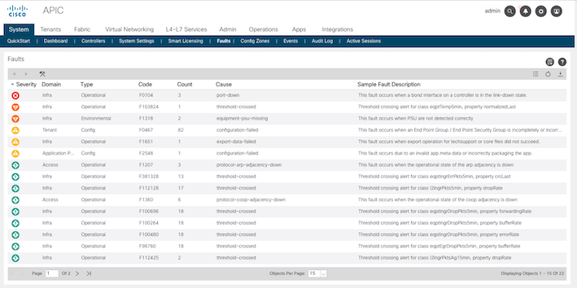
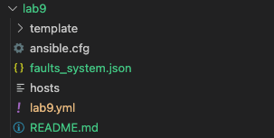
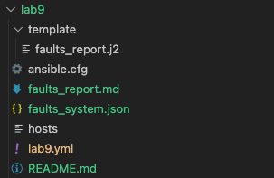
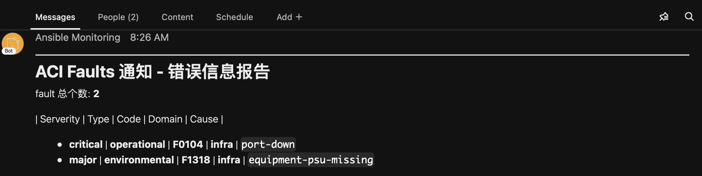

# Ansible LAB #4 - 把 ACI 中的 Fault Count 发送到 Webex Team 

<br><br>

## Lab 步骤

<br>

1. 在 ACI System > Faults 界面查看当前 Faults 信息。



<br><br>

2. 查看在 ansible 抓取 Fault 信息的脚本。(main.yml)
```yaml
  tasks:
    - name: "1] API Request - 收集 System Fault 概况"
      aci_rest:
        <<: *apic_info
        path:   "/api/node/class/faultSummary.json?query-target-filter=or(eq(faultSummary.severity,\"critical\"),eq(faultSummary.severity,\"major\"))&order-by=faultSummary.severity|desc"
        method: get
      register: faults_system
    
    - name: "2] (OPTIONAL) 把收集的信息导出到 JSON 文件中"
      copy:
        content: "{{ faults_system | to_nice_json}}"
        dest:    "./faults_system.json"
```
- faultSummary 클래스를 이용하여 REST API를 호출하고, Faults 현황을 수집합니다.
- query-target-filter 를 이용하여 심각도가 critical, major 인 것만 수집을 하고, 심각도 순으로 정렬합니다.
- (OPTIONAL) 수집된 데이터를 json 파일로 저장합니다. 랩 상에서 데이터를 확인하기 위한 태스크입니다.

<br><br>

3. Playbook을 실행하여, 수집된 데이터를 확인합니다.

```
ansible-playbook -i hosts main.yml
```

- faults_system.json 파일을 확인합니다.

  

<br><br>

4. 수집한 데이터를 Webex 메시지 포맷에 맞게 변환하는 태스크를 추가합니다.
- main.yml
```yaml
    - name: "3] 추가 변수 설정 - 메시지 추가 제목"
      set_fact:
        add_title: "CHANGE_ME"

    - name: "3] 수집한 데이터를 Webex 메시지 형태의 파일로 변환 (Markdown 포맷)"
      template: 
        src:  "template/faults_report.j2"
        dest: "faults_report.md"
```
- "CHANGE_ME"를 임의의 값으로 수정합니다.

<br>

- template/faults_report.j2 파일은 faults_system 변수의 내용을 Markdown 형식의 파일로 변환합니다.
```jinja
---
# ACI Faults 카운트 알림 - {{ add_title }}

fault 카테고리의 총 개수: **{{ faults_system.totalCount }}**

| Serverity | Type | Code | Domain | Cause |


- **{{ fault.faultSummary.attributes.severity }}** | **{{ fault.faultSummary.attributes.type }}** | **{{ fault.faultSummary.attributes.code }}** | **{{ fault.faultSummary.attributes.domain }}** | `{{ fault.faultSummary.attributes.cause }}`

```

<br><br>

5. Playbook을 실행하여, 생성된 메시지 파일을 확인합니다.
```
ansible-playbook -i hosts main.yml
```
<br>

- fault_report.md 파일을 확인합니다.

    

<br><br>

6. Webex로 메시지를 전송하는 태스크를 추가합니다.

```yaml
    - name: "4] Webex로 전송할 메시지 파일 읽기"
      debug:    msg="{{ lookup('file', 'faults_report.md') }}"
      register: faults_report
      no_log:   yes 

    - name: "5] Webex로 메시지 전송"
      cisco_spark:
        recipient_type: roomId
        recipient_id:   "{{ roomID }}"
        message_type:   markdown
        personal_token: "{{ bot_token }}"
        message:        "{{ faults_report.msg }}"
```
- lookup('file', 파일명) 함수는 대상 파일을 텍스트 형태로 읽어옵니다.

<br><br>

7. 인벤토리 파일에서 Webex Teams 관련 정보를 업데이트합니다. 
```
[aci:vars]
...
roomID=CHANGE_ME
bot_token=CHANGE_ME
```
- roomID는 메시지를 수신받을 Webex Teams Room 입니다. CHANGE_ME를 수정합니다.
- bot_token는 메시지를 전송하는 유저(봇)의 정보입니다. CHANGE_ME를 수정합니다.
- Webex Teams Room 과 Bot은 미리 생성해 둡니다.


<br><br>

8. 执行 Playbook，并在 Webex Teams 中查看是否收到相应的消息。
```
ansible-playbook -i hosts main.yml
```
<br>

- 查看 fault_report.md 文件内容。

    
