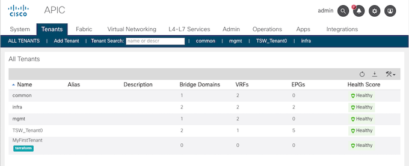
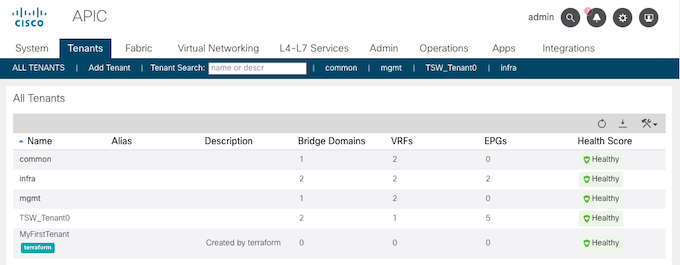
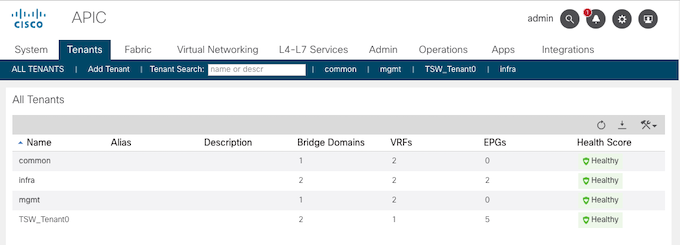

# Lab 1 - Terraform CLI 익히기

본 시나리오를 통해 다음 내용을 다룹니다.

- terraform init 명령
- terraform plan 명령
- terraform apply 명령
- variable 사용법
- terraform destroy 명령

<br>

## Lab 실행 순서

<br>

1. 먼저 main.tf 파일 내용을 살펴봅니다.
    ```
    terraform {
        required_providers {
            aci = {
                source  = "CiscoDevNet/aci"
                version = "0.7.0"
            }
        }
        required_version = ">=0.13.4"
    }

    provider "aci" {
        username = var.aci_user
        password = var.aci_pw
        url      = var.aci_url
        insecure = var.aci_https
    }

    resource "aci_tenant" "my_tenant" {
        name = "MyFirstTenant"
        # description = "Created by terraform"
    }
    ```

<br>

2. 작업 디렉토리를 초기화합니다.
    ```
    terraform init
    ```

<br>

3. 플랜을 실행하고, 변수값을 입력합니다.
    ```
    terraform plan

    var.aci_pw
    Enter a value: 

    var.aci_url
    Enter a value: 

    var.aci_user
    Enter a value:
    ```
    - var.aci_pw: C1sco12345
    - var.aci_user: admin
    - var.aci_url: https://apic1.dcloud.cisco.com

<br>

4. 인프라를 배포합니다.
    ```
    terraform apply \
    -var aci_pw=C1sco12345 \
    -var aci_user=admin \
    -var aci_url=https://apic1.dcloud.cisco.com
    ```
    - 참고: -var 옵션은 .tf 파일에서 사용할 변수의 값을 직접 넘겨줍니다.

<br>

5. ACI에서 배포된 인프라를 확인합니다. (확인 메뉴: Tenant > All TENANTS)

    

<br>

6. main.tf에서 20번째 라인의 '#'을 삭제하고, 플랜을 실행합니다. 변수값은 variable.tfvars 에 작성된 내용을 전달합니다.

    - 변경 전
        ```
        resource "aci_tenant" "my_tenant" {
            name = "MyFirstTenant"
            # description = "Created by terraform"
        }
        ```
    - 변경 후
        ```
        resource "aci_tenant" "my_tenant" {
            name = "MyFirstTenant"
            description = "Created by terraform"
        }
        ```

    ```
    terraform plan -var-file variable.tfvars
    ```
    - 참고: -var-file 옵션은 .tf 파일에서 사용되는 변수의 값이 작성된 파일명을 전달합니다.
    - 참고: Plan 결과를 통해, "MyFirstTenant" 테넌트는 속성만 업데이트되고, 삭제 및 재생성되지 않음을 확인할 수 있습니다.

<br>

7. 변경사항을 인프라에 배포합니다. 

    ```
    terraform apply -var-file variable.tfvars -auto-approve
    ```
    - 참고: -auto-approve 옵션을 추가하면, Terraform apply에서 작업 실행 여부를 묻지않고 배포작업을 진행합니다.

<br>

8. ACI에서 변경 사항을 확인합니다.

    

<br>

9. 테라폼에서 배포한 모든 리소스를 삭제합니다.

    ```
    terraform destroy -var-file variable.tfvars
    ```

<br>

10. ACI에서 삭제된 리소스를 확인합니다.

    