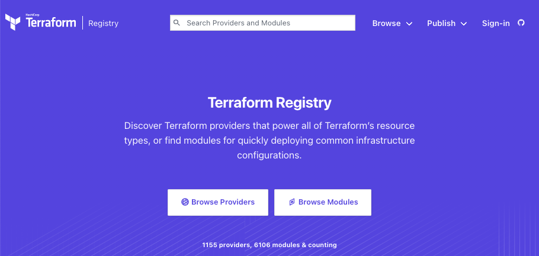
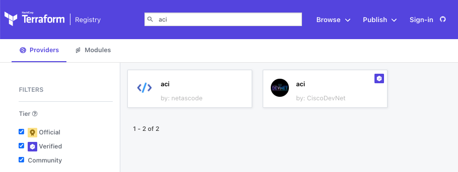
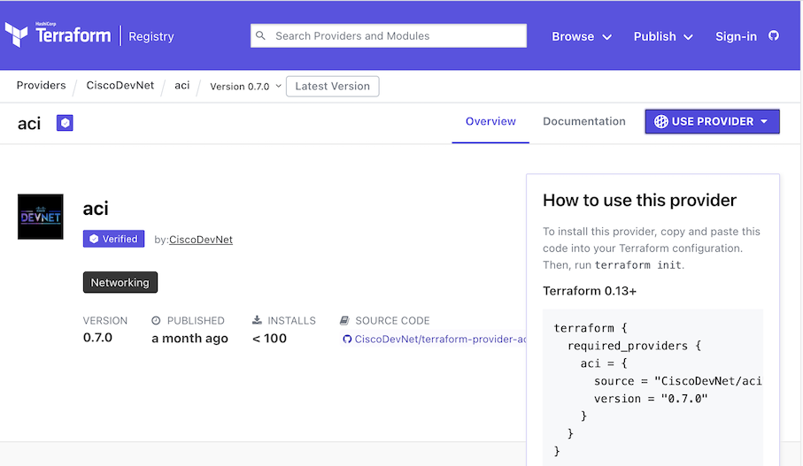
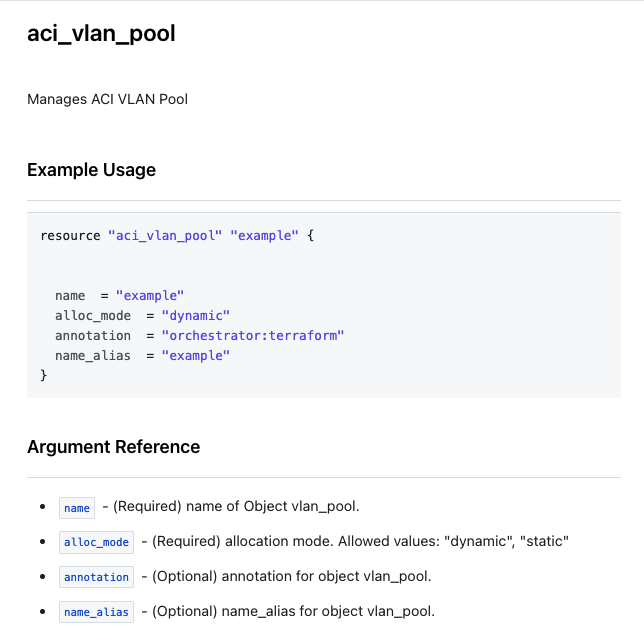
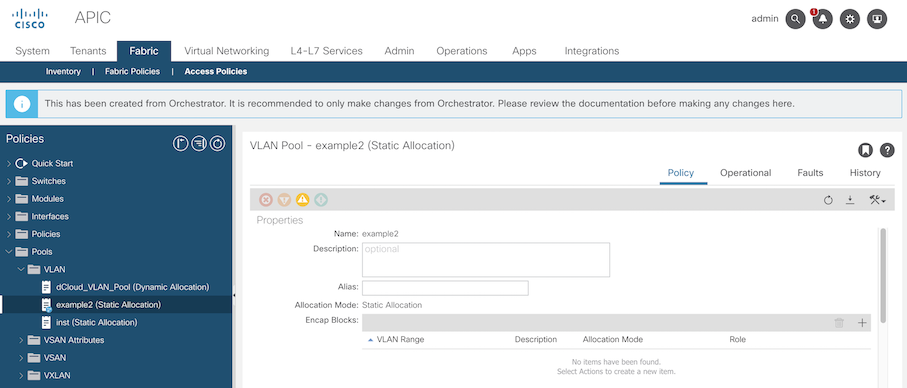
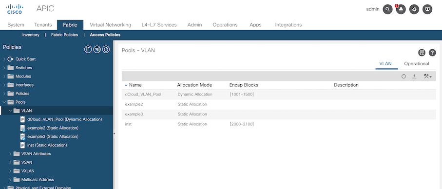

# Lab 2 - 创建 Resource 

本 Lab 是 在 Fabric -> Access 下创建 VLAN Pool 的 Resource。通过本 Lab 了解以下内容。

- 参考 Terraform Provider Document 来编写相应的脚本。
- 利用 variable 来实现代码的重复利用
- 使用 terraform 自带的函数来实现多种功能

<br>

## Lab 步骤  

<br>

1. 浏览器打开 https://registry.terraform.io/ 网站。

    

<br><br>

2. 搜索 "aci"，并点击进入 aci (by CiscoDevNet) provider。

    

<br><br>

3. 可以查看 ACI Provider 信息。

    

<br><br>

4. 在该界面中点击 Document，或者直接访问 https://registry.terraform.io/providers/CiscoDevNet/aci/latest/docs 。在 Document 页面中科院查看 ACI Provider 提供的所有的 Resource 数据以及其使用方法。在页面中搜索 VLAN Pool，在搜索结果中点击 aci_vlan_pool。

    

<br><br>

5. 可以查看到 aci_vlan_pool Resource的使用范例，以及该 Resource 提供的选项的具体内容。

    

    - 在属性中有 (Required) 和 (Optional) 两种类型。

<br><br>

6. 把 Example 脚本复制到 main.tf 文件中。

    ```
    resource "aci_vlan_pool" "example" {
        name        = "example"
        alloc_mode  = "dynamic"
        annotation  = "orchestrator:terraform"
        name_alias  = "example"
    }
    ```

<br><br>

7. 把编写好的脚本下发到 ACI 中。

    ```
    terraform init
    
    terraform plan
    
    terraform apply
    ```

<br><br>

8. 在 ACI 中查看生成的 VLAN Pool 信息。 
    - Fabric > Access Policies > Pools > VLAN 

    

<br><br>

9. 之前所有的信息都是存储在 main.tf 文件中。为了把变量数据与主文件内容分离开，把变量信息存储到 variable.tf 文件和 access.auto.tfvars 文件中。

    - variable.tf

        ```
        variable "vlan_pools" {
            type    = map(any)
            default = {}
        }
        ```
    
    - access.auto.tfvars 

        ```
        vlan_pools = {
            DEMO_VLAN = {
                vlan_name  = "example2",
                alloc_mode = "static"
            }
        }
        ```

<br><br>

10. 在 main.tf 文件中把 aci_vlan_pool.example Resource 部分修改为以下内容。

    - 变更前
        ```
        resource "aci_vlan_pool" "example" {
            name       = "example"
            alloc_mode = "dynamic"
            annotation = "orchestrator:terraform"
            name_alias = "example"
        }
        ```
    - 变更后
        ```
        resource "aci_vlan_pool" "example" {
            name       = var.vlan_pools.DEMO_VLAN.vlan_name
            alloc_mode = var.vlan_pools.DEMO_VLAN.alloc_mode
            annotation = contains(keys(var.vlan_pools.DEMO_VLAN), "annotation") ? var.vlan_pools.DEMO_VLAN.annotation : null
            name_alias = contains(keys(var.vlan_pools.DEMO_VLAN), "name_alias") ? var.vlan_pools.DEMO_VLAN.name_alias : null
        }
        ```
        - 这里使用到了 Terraform 内部 constrains()，keys()，bool 条件函数。

<br><br>

11. 把修改的信息在 ACI 中下发。

    ```
    terraform plan
    
    terraform apply
    ```
    - 在执行 CLI 命令时，及时没有指定 variable 数值，Terrform 会自动的去调用 access.auto.tfvars 中的变量值。
    
<br><br>

12. 在 ACI 中查看生成的 VLAN Pool 信息。 
    - Fabric > Access Policies > Pools > VLAN 

        

        - 变更后，可以看到 "example" VLAN 被删除，而 "example2" VLAN Pool 被新生成。可以参考 Terraform plan 结果。

<br><br>

13. 为了添加新的 VLAN Pool，在 access.auto.tfvars 文件中添加 vlan pool 信息。
    - 变更前
        ```
        vlan_pools = {
            DEMO_VLAN = {
                vlan_name  = "example2",
                alloc_mode = "static"
            }
        }
        ```
    - 变更后
        ```
        vlan_pools = {
            DEMO_VLAN = {
                vlan_name  = "example2",
                alloc_mode = "static"
            },
            DEMO_VLAN2 = {
                vlan_name  = "example3",
                alloc_mode = "static"
            }
        }
        ```

<br><br>

14. 为了添加新的 VLAN Pool，需要修改 main.tf 文件。但是不是直接在该文件中添加 aci_vlan_pool Resource，而是以循环方法追加相应的 Resource。把 main.tf 文件修改为如下内容。

    - 变更前
        ```
        resource "aci_vlan_pool" "example" {
            name       = var.vlan_pools.DEMO_VLAN.vlan_name
            alloc_mode = var.vlan_pools.DEMO_VLAN.alloc_mode
            annotation = contains(keys(var.vlan_pools.DEMO_VLAN), "annotation") ? var.vlan_pools.DEMO_VLAN.annotation : null
            name_alias = contains(keys(var.vlan_pools.DEMO_VLAN), "name_alias") ? var.vlan_pools.DEMO_VLAN.name_alias : null
        }
        ```
    - 变更后
        ```
        resource "aci_vlan_pool" "example" {
            for_each   = var.vlan_pools
            name       = each.value.vlan_name
            alloc_mode = each.value.alloc_mode
            annotation = contains(keys(each.value), "annotation") ? each.value.annotation : null
            name_alias = contains(keys(each.value), "name_alias") ? each.value.name_alias : null
        }
        ```
        - 这里使用到 Terraform 内容 for_each 函数来实现重复操作。

<br><br>

15. 把变更的信息在 ACI 中进行下发。

    ```
    terraform plan
    
    terraform apply
    ```

<br><br>

16. 在 ACI 中查看生成的 VLAN Pool 信息。 
    - Fabric > Access Policies > Pools > VLAN 

        

        - 新的 "example3" VLAN Pool 生成

<br><br>

17. 把 Terraform 生成的 Resource 进行删除。

    ```
    terraform destroy
    ```
