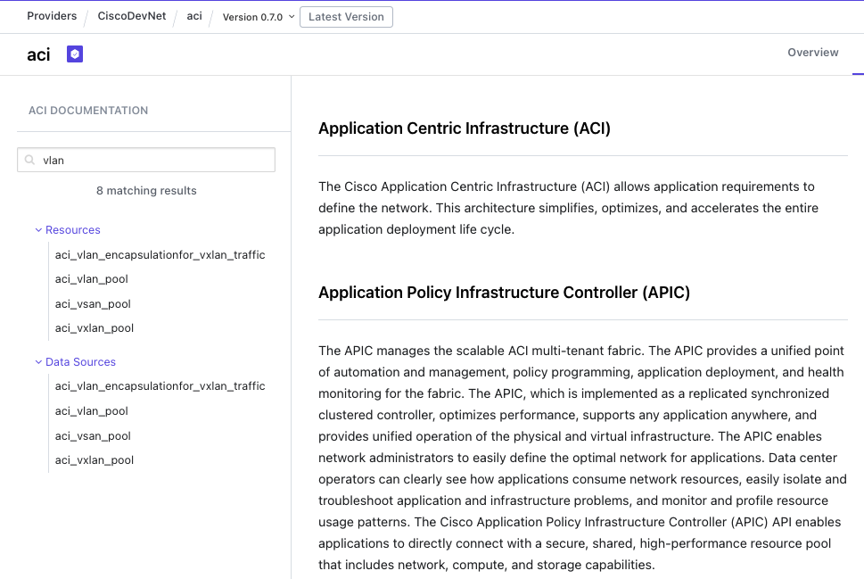

# Lab 2 - 创建 Resource 

本 Lab 是 在 Fabric -> Access 下创建 VLAN Pool 的 Resource。通过本 Lab 了解以下内容。

- 参考 Terraform Provider Document 来编写相应的脚本。
- 利用 variable 来实现代码的重复利用
- 使用 terraform 自带的函数来实现多种功能

<br>

## Lab 步骤  

<br>

1. 浏览器打开 https://registry.terraform.io/ 网站。

    

<br><br>

2. 搜索 "aci"，并点击进入 aci (by CiscoDevNet) provider。

    

<br><br>

3. 可以查看 ACI Provider 信息。

    

<br><br>

4. Document 링크를 클릭하거나, https://registry.terraform.io/providers/CiscoDevNet/aci/latest/docs 로 접속하여 Document 페이지로 이동합니다. Document 페이지에서는 ACI 프로바이더에서 제공하는 Resource와 Data의 사용법을 확인할 수 있습니다. VLAN Pool의 Resource를 찾기 위하여, 페이지 왼쪽 검색창에서 vlan을 입력합니다. Resources의 검색 결과에서 aci_vlan_pool 을 클릭합니다.

    

<br><br>

5. aci_vlan_pool Resource에 대한 사용예시와 해당 Resource에서 제공하는 모든 속성 정보를 확인할 수 있습니다.

    

    - 참고: 속성에는 (Required)와 (Optional) 2가지 종류가 있습니다.

<br><br>

6. 사용 예시를 복사하여, main.tf 파일에 붙여 넣습니다.

    ```
    resource "aci_vlan_pool" "example" {
        name        = "example"
        alloc_mode  = "dynamic"
        annotation  = "orchestrator:terraform"
        name_alias  = "example"
    }
    ```

<br><br>

7. 작성한 코드를 ACI에 배포합니다.

    ```
    terraform init
    
    terraform plan
    
    terraform apply
    ```

<br><br>

8. ACI에서 생성된 VLAN Pool을 확인합니다. 
    - Fabric > Access Policies > Pools > VLAN 

    

<br><br>

9. 현재 ACI에 배포할 리소스의 설정값(예: VLAN Pool 이름)은 main.tf 파일에는 작성되어 있습니다. main.tf에서 리소스의 설정값을 변수 파일로 분리하기 위하여, variable.tf 파일과 access.auto.tfvars 파일을 열고 아래와 같이 입력합니다.

    - variable.tf

        ```
        variable "vlan_pools" {
            type    = map(any)
            default = {}
        }
        ```
    
    - access.auto.tfvars 

        ```
        vlan_pools = {
            DEMO_VLAN = {
                vlan_name  = "example2",
                alloc_mode = "static"
            }
        }
        ```

<br><br>

10. main.tf 파일에서 aci_vlan_pool.example 리소스를 아래와 같이 수정합니다.

    - 변경 전
        ```
        resource "aci_vlan_pool" "example" {
            name       = "example"
            alloc_mode = "dynamic"
            annotation = "orchestrator:terraform"
            name_alias = "example"
        }
        ```
    - 변경 후
        ```
        resource "aci_vlan_pool" "example" {
            name       = var.vlan_pools.DEMO_VLAN.vlan_name
            alloc_mode = var.vlan_pools.DEMO_VLAN.alloc_mode
            annotation = contains(keys(var.vlan_pools.DEMO_VLAN), "annotation") ? var.vlan_pools.DEMO_VLAN.annotation : null
            name_alias = contains(keys(var.vlan_pools.DEMO_VLAN), "name_alias") ? var.vlan_pools.DEMO_VLAN.name_alias : null
        }
        ```
        - 참고: Terraform 내부 함수인 constrains()와 keys(), bool 조건함수"?" 를 사용하고 있습니다.

<br><br>

11. 변경사항을 ACI에 배포합니다.

    ```
    terraform plan
    
    terraform apply
    ```
    - 참고: CLI 실행 시, 파라미터로 variable 설정을 하지 않아도, access.auto.tfvars의 변수값이 적용됩니다.
    
<br><br>

12. ACI에서 생성된 VLAN Pool을 확인합니다. 
    - Fabric > Access Policies > Pools > VLAN 

        

        - 변경 결과, "example" VLAN이 삭제되고, "example2" VLAN Pool이 새로 생성됩니다. Terraform plan 결과를 참고하시기 바랍니다.

<br><br>

13. 새로운 VLAN Pool을 추가하기 위하여 access.auto.tfvars 파일의 vlan_pools 변수값에 새로운 vlan pool 정보를 추가합니다.
    - 변경 전
        ```
        vlan_pools = {
            DEMO_VLAN = {
                vlan_name  = "example2",
                alloc_mode = "static"
            }
        }
        ```
    - 변경 후
        ```
        vlan_pools = {
            DEMO_VLAN = {
                vlan_name  = "example2",
                alloc_mode = "static"
            },
            DEMO_VLAN2 = {
                vlan_name  = "example3",
                alloc_mode = "static"
            }
        }
        ```

<br><br>

14. 새로운 VLAN Pool을 추가하기 위하여 main.tf 파일을 수정합니다. 다만, aci_vlan_pool 리소스를 새로 추가하지 않고, 기존의 리소스에서 여러 리소스를 생성할 수 있도록 수정합니다. main.tf 파일에서 aci_vlan_pool.example 리소스를 아래와 같이 수정합니다.

    - 변경 전
        ```
        resource "aci_vlan_pool" "example" {
            name       = var.vlan_pools.DEMO_VLAN.vlan_name
            alloc_mode = var.vlan_pools.DEMO_VLAN.alloc_mode
            annotation = contains(keys(var.vlan_pools.DEMO_VLAN), "annotation") ? var.vlan_pools.DEMO_VLAN.annotation : null
            name_alias = contains(keys(var.vlan_pools.DEMO_VLAN), "name_alias") ? var.vlan_pools.DEMO_VLAN.name_alias : null
        }
        ```
    - 변경 후
        ```
        resource "aci_vlan_pool" "example" {
            for_each   = var.vlan_pools
            name       = each.value.vlan_name
            alloc_mode = each.value.alloc_mode
            annotation = contains(keys(each.value), "annotation") ? each.value.annotation : null
            name_alias = contains(keys(each.value), "name_alias") ? each.value.name_alias : null
        }
        ```
        - 참고: Terraform 내부 함수인, for_each를 사용하여 반복 처리를 수행합니다.

<br><br>

15. 변경사항을 ACI에 배포합니다.

    ```
    terraform plan
    
    terraform apply
    ```

<br><br>

16. ACI에서 생성된 VLAN Pool을 확인합니다. 
    - Fabric > Access Policies > Pools > VLAN 

        

        - 변경 결과, "example3" VLAN Pool이 새로 생성됨

<br><br>

17. Terraform에서 배포한 리소스를 모두 삭제합니다.

    ```
    terraform destroy
    ```
