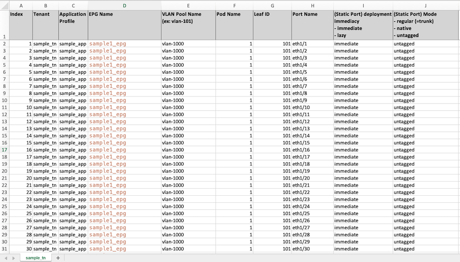
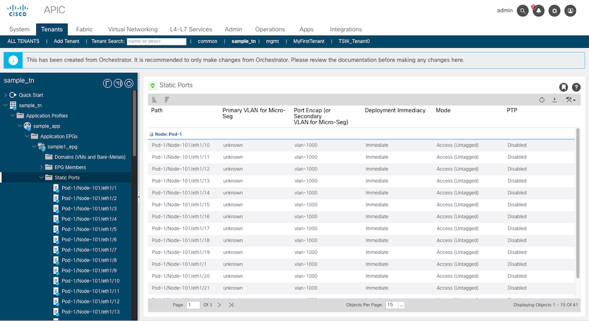

# Lab 5 - Static Port 생성

본 시나리오에서는 Static Port를 생성합니다.

<br><br>

## Lab 진행 순서  

<br>

1. main.tf 파일의 내용을 살펴봅니다.
```
terraform {
  required_providers {
    aci = {
      source  = "CiscoDevNet/aci"
      version = "0.7.0"
    }
  }
  required_version = ">=0.13.4"
}

provider "aci" {
  username = var.secret.user
  password = var.secret.pw
  url      = var.secret.url
  insecure = true
}

resource "aci_epg_to_static_path" "aci_static_path" {
  for_each           = var.epg_static_paths
  application_epg_dn = format("uni/tn-%s/ap-%s/epg-%s", each.value.tenant, each.value.ap, each.value.epg)
  tdn                = format("topology/pod-%s/paths-%s/pathep-[%s]", each.value.pod, each.value.node, each.value.port)
  encap              = each.value.encap
  instr_imedcy       = each.value.deployment_immediacy
  mode               = each.value.mode
}
```
- format() 함수는 문자열의 특정값을 치환합니다.

<br><br>

2. 모든 스위치의 개별 포트단위로 static port 정책을 설정하고자 합니다. static port 관련 스크립트를 직접 작성하지 않고, 엑셀파일로부터 정보를 읽어와 .tfvars 파일로 변환합니다. 먼저 엑셀파일의 내용을 살펴봅니다.
- files/static_ports.xlsx 을 MS Excel을 이용하여 엽니다.

    

3. 내용을 확인하고 엑셀파일을 저장합니다. 다음으로 python 스크립트를 이용하여 xslx 파일 내용을 static_port.auto.tfvars 파일을 생성힙니다.

```
cd files
python static_port.py
```

4. 새로 생성된 static_ports.auto.tfvars 파일을 살펴봅니다.

```
epg_static_paths = { 

  idx_static_port_1 = {
    tenant               = "sample_tn",
    ap                   = "sample_app",
    epg                  = "sample1_epg",
    pod                  = "1",
    node                 = "101",
    port                 = "eth1/1",
    encap                = "vlan-1000",
    deployment_immediacy = "immediate",
    mode                 = "untagged"
  },
  idx_static_port_2 = {
    tenant               = "sample_tn",
    ap                   = "sample_app",
    epg                  = "sample1_epg",
    pod                  = "1",
    node                 = "101",
    port                 = "eth1/2",
    encap                = "vlan-1000",
    deployment_immediacy = "immediate",
    mode                 = "untagged"
  },

  ...
  
  idx_static_port_41 = {
    tenant               = "sample_tn",
    ap                   = "sample_app",
    epg                  = "sample1_epg",
    pod                  = "1",
    node                 = "101",
    port                 = "eth1/41",
    encap                = "vlan-1000",
    deployment_immediacy = "immediate",
    mode                 = "untagged"
  },
}
```

5. static port를 생성합니다.

```
terraform init

terraform plan

terraform apply
```
- 실행 결과를 ACI 에서 확인합니다.

    